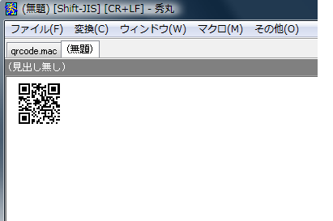

秀丸からQRコードを生成するマクロ
======
「ポメラ」のQRコード生成を真似てみました。

# ファイル

|ファイル|説明|
|:--:|:--:|
|qrcode.mac|マクロ本体（ショートカットキーを割り当てて下さい）|
|qrcode.hilight|マクロから使用するハイライト定義|
|qrcode_hidemaru.exe|QRコードを生成するコマンド|

# 動作

選択範囲があればその範囲を変換します。 
選択範囲がなければファイル全体を変換します。

# 制限

自分の環境では800文字前後で携帯から読み取れなくなりました、液晶モニタ越しでは厳しいようです・・・

# 連絡先

<http://d.hatena.ne.jp/ohtorii/>  
<https://twitter.com/ohtorii>  
<https://github.com/ohtorii>